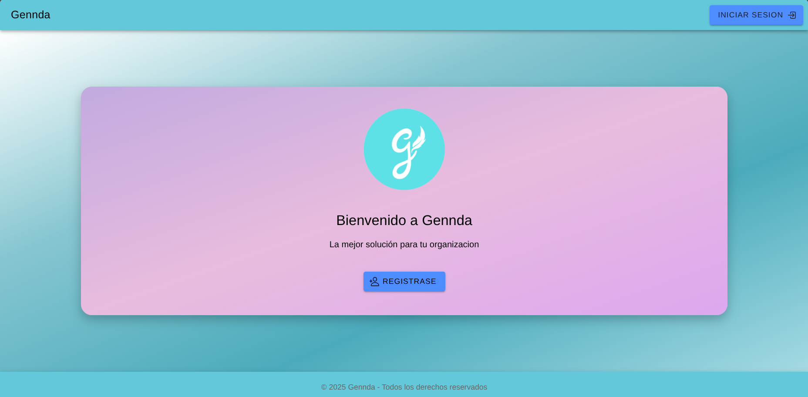
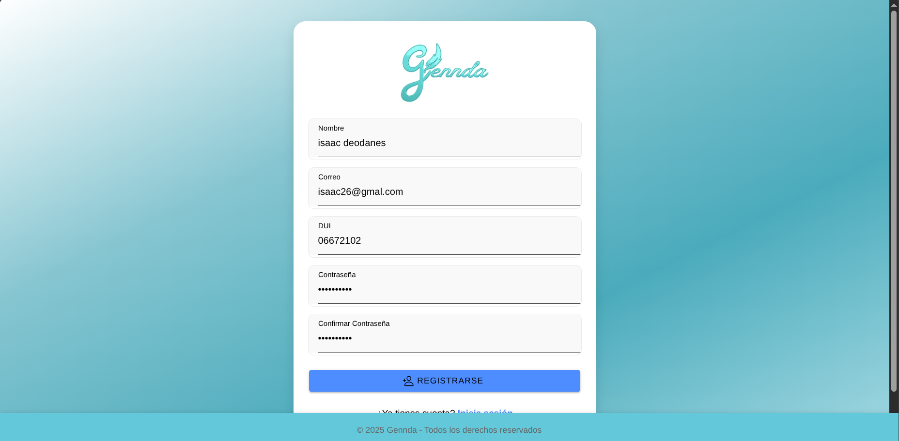
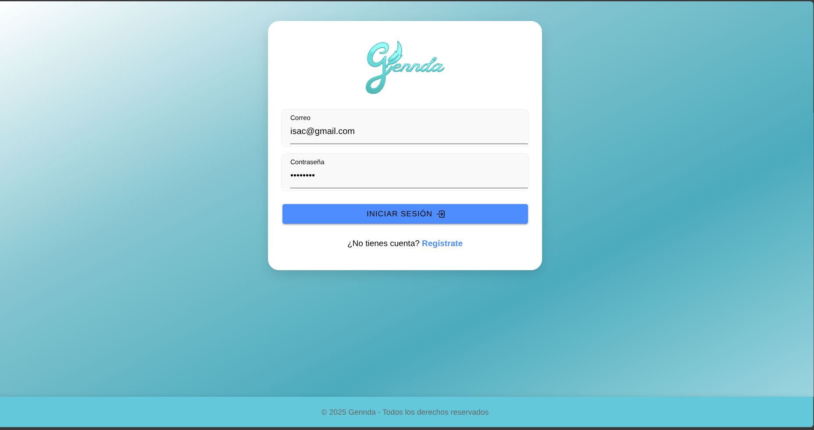
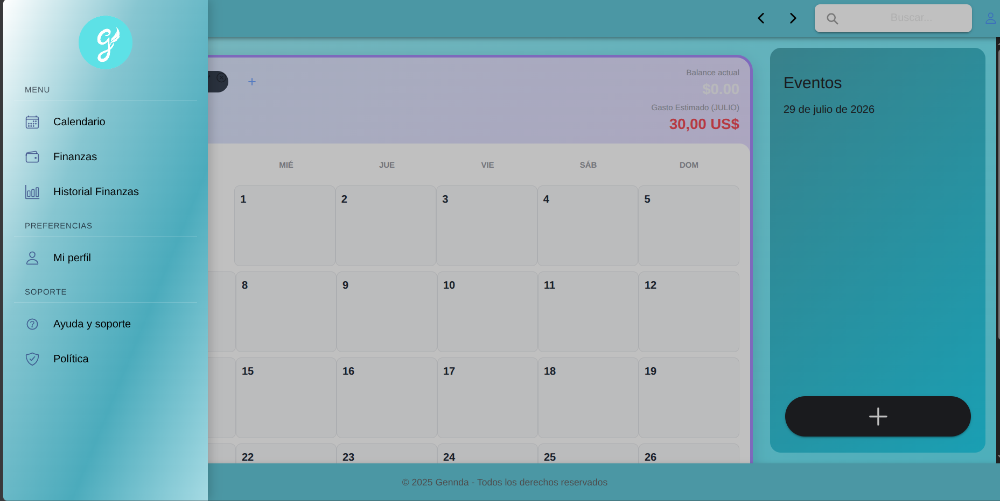
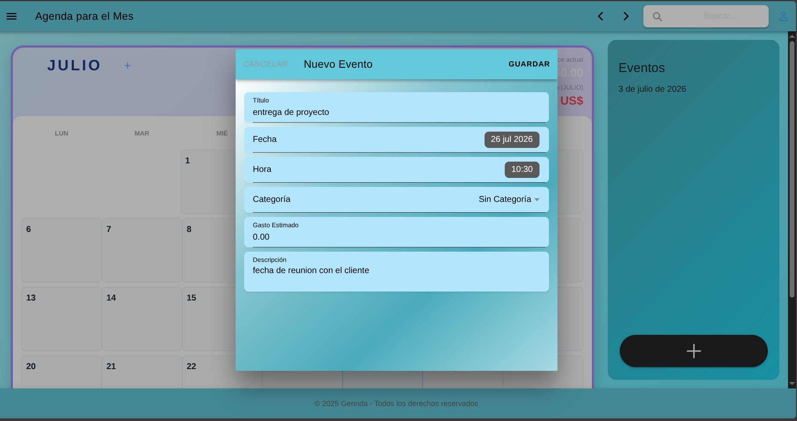
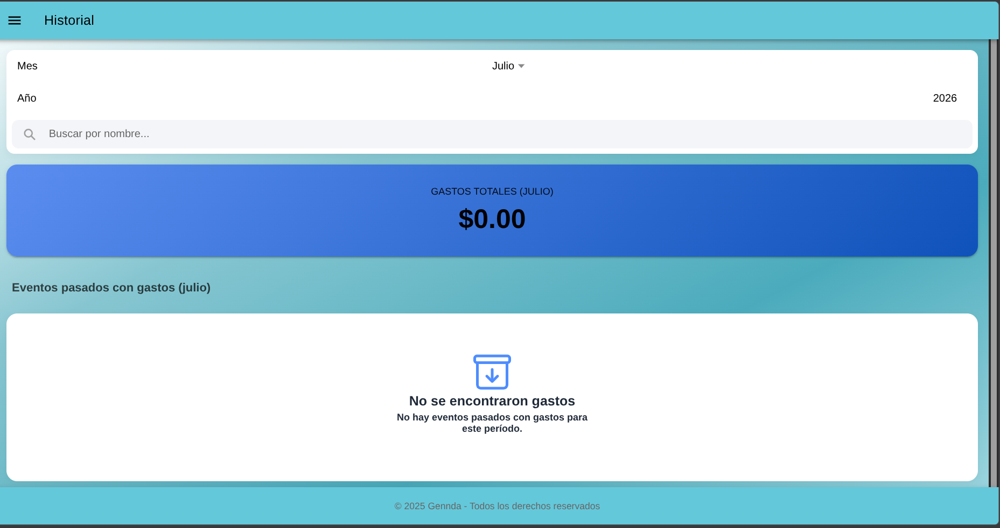
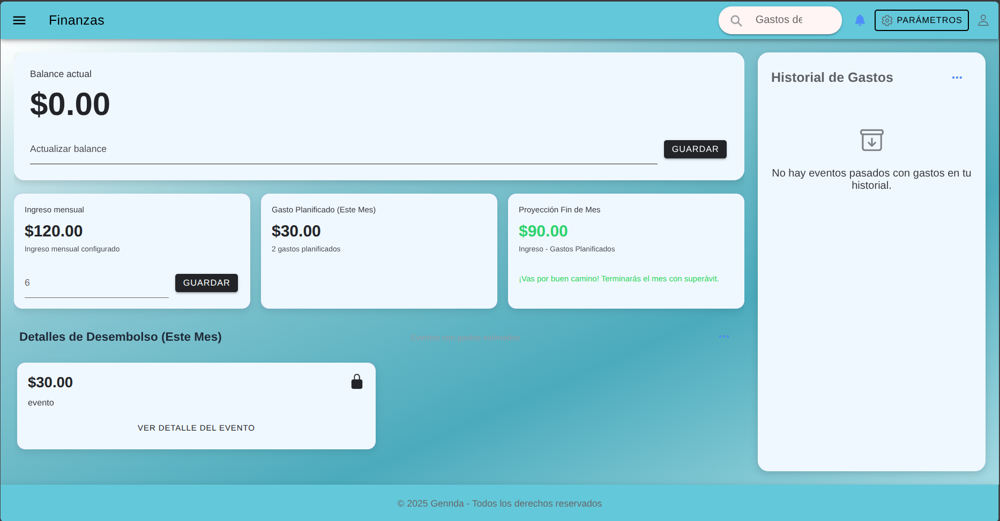
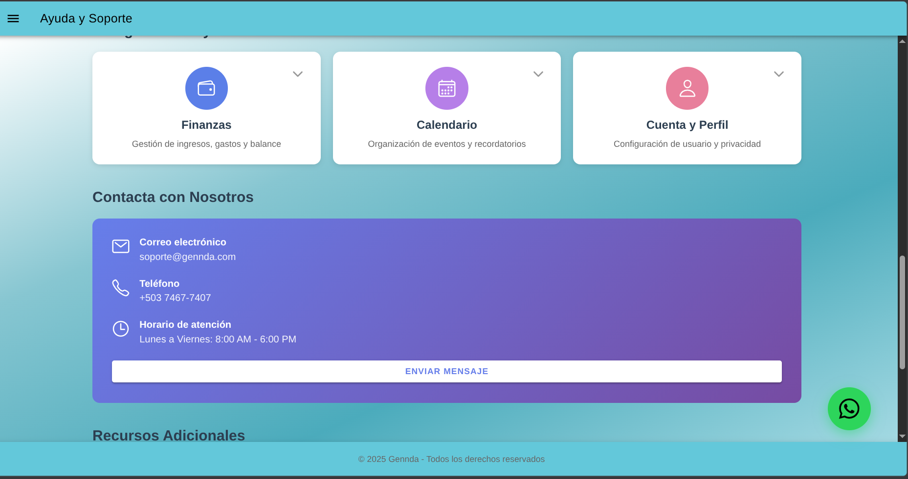
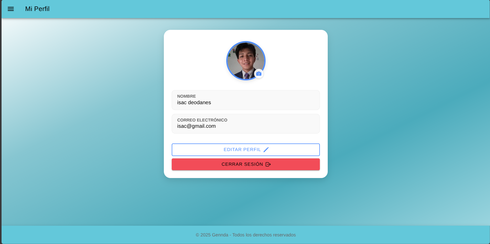

# 📅 Gennda — Aplicación Híbrida de Agendas y Finanzas

Aplicación móvil híbrida (Android, iOS y Web) que permite administrar la agenda personal y laboral, y llevar el control de las finanzas asociadas, desde un mismo lugar.


---

## 📋 Descripción

Gennda nació como proyecto universitario desarrollado por un **equipo de 4 desarrolladores**. Es una aplicación híbrida —compilada de forma nativa para Android e iOS con Capacitor, y también accesible desde la web— que centraliza la agenda personal/laboral del usuario junto con el control de sus finanzas.

<p align="center">
  
    
  
  
  
  
  
  
  
   
</p>

### Módulos de la aplicación
Agenda · Calendario · Finanzas · Historial financiero · Ayuda y soporte · Políticas · Perfil

---

## 👤 Mi rol en el equipo

Este proyecto fue construido colaborativamente. Mis responsabilidades específicas dentro del equipo fueron:

- Desarrollo del **menú de navegación** de la aplicación.
- Construcción de la **vista de Políticas de Privacidad**, integrada con el flujo de registro e inicio de sesión (la creación de cuenta queda condicionada a la aceptación de las políticas).
- Ajustes de **estilos e interfaz** adaptados a las particularidades de cada plataforma (iOS, Android, Web).
- Consumo de la API mediante Axios en los componentes del frontend.

---

## ⚙️ Funcionalidades principales

**Agenda**
- Crear, editar y eliminar eventos.
- Visualizar eventos en el calendario.
- Registrar eventos de trabajo y eventos familiares.
- Asociar un gasto estimado a un evento.

**Calendario**
- Visualizar eventos por día y consultar lo programado.

**Finanzas**
- Administrar ingresos, gastos y balances.
- Los gastos registrados desde un evento se reflejan automáticamente en el historial financiero.

**Historial financiero**
- Consultar el historial de ingresos y gastos.

---

## 🛠️ Stack tecnológico

- **Frontend móvil:** Vue 3, Ionic Vue 8, TypeScript, Capacitor (compilación nativa iOS/Android), Vue Router, Axios, Element Plus
- **Backend:** Laravel 9, PHP, Laravel Sanctum (autenticación por tokens), Laravel CORS
- **Base de datos:** MySQL
- **Pruebas de API:** Postman

---

## 🗂️ Estructura del repositorio

```
gennda/
├── Api/        # Backend — Laravel 9 + Sanctum (API REST)
└── Gennda/     # Frontend — Ionic + Vue 3 + TypeScript + Capacitor
```

---

## 🚀 Instalación y ejecución

**Requisitos:** XAMPP o Laragon (Apache + MySQL), Composer, Node.js, Ionic CLI.

### Backend (`Api/`)
1. Iniciar Apache y MySQL desde XAMPP o Laragon.
2. Crear la base de datos con el mismo nombre definido en `.env` (por ejemplo, `apigennda_db`).
3. Instalar dependencias:
   ```bash
   cd Api
   composer install
   ```
4. Ejecutar las migraciones:
   ```bash
   php artisan migrate
   ```
5. Levantar la API:
   ```bash
   php artisan serve
   ```

### Frontend (`Gennda/`)
1. Instalar dependencias:
   ```bash
   cd Gennda
   npm install
   ```
2. Ejecutar la aplicación:
   ```bash
   ionic serve
   ```

---

## 👨‍💻 Autor

**Isaac Dagoberto Deodanes Benitez**
Desarrollador Full Stack Jr
📧 isacdeodanes@gmail.com · 💻 [GitHub](https://github.com/isac-deodanes) · 🔗 [LinkedIn](https://www.linkedin.com/in/isaac-deodanes-a31a26379/)

*Proyecto desarrollado en equipo como parte de la formación académica.*
